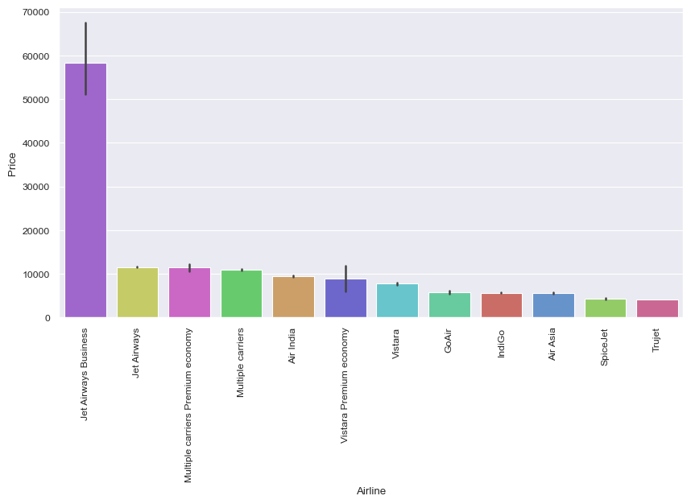
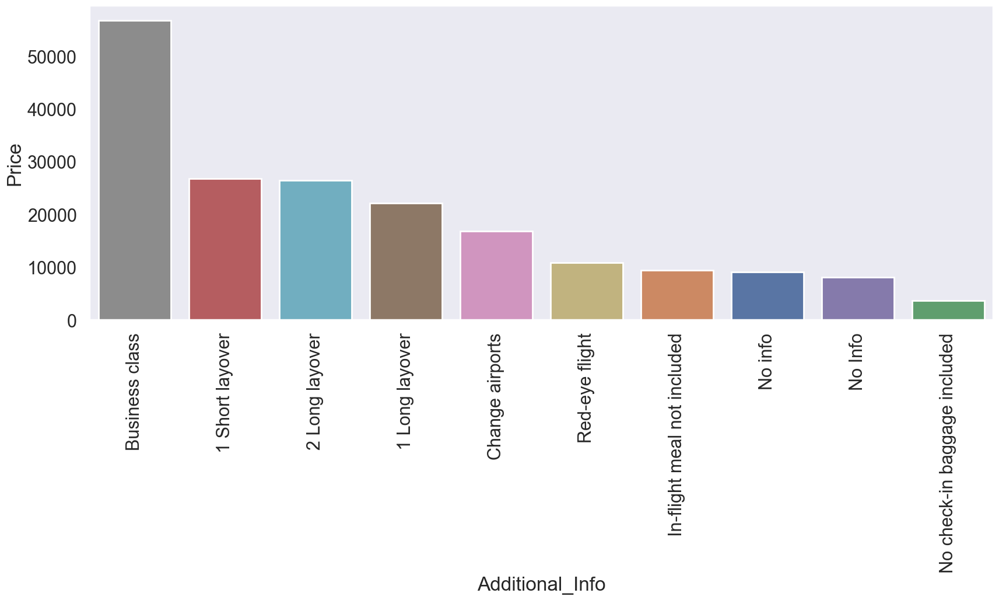
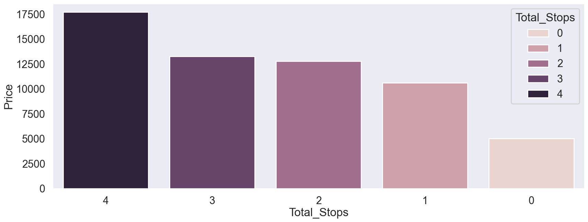

# Flight Price Predictor

## 🧩 Problem Statement
Flight ticket prices fluctuate frequently based on various factors, making it challenging for travelers to determine the best time and option to book. This project aims to develop a flight price predictor using machine learning to estimate the cost of a flight based on inputs like airline, journey date, duration, and stops. The goal is to provide users with a reliable estimate of ticket prices using historical flight data.

---

## 📊 Dataset

- **Source**: The file can be found in Notebook\data\flight-price.xlsx
- **Shape**: `10682 rows × 11 columns`

### ✏️ Features:
1. **Airline** – Name of the airline  
2. **Date_of_Journey** – Date on which journey commenced  
3. **Source** – City of origin  
4. **Destination** – Final destination  
5. **Route** – Path taken by the flight  
6. **Dep_Time** – Departure time  
7. **Arrival_Time** – Arrival time  
8. **Duration** – Total time from takeoff to landing  
9. **Total_Stops** – Number of stops  
10. **Additional_Info** – Extra details such as meal availability or class type

---

## 🧹 Data Preprocessing
1. The data contained only a few missing values and duplicate entries so these entries where dropped.
2. The Date_of_Journey column contained dates in DD/MM/YYYY format so string.split() function was used to separate the data into day_of_journey, month_of_journey and year_of_journey columns and saved in the table.
3. Dep_Time was present in HH:MM format so string.split() function was used, and the hours and minutes were saved in separate columns.
4. Arrival_Time also had a similar format as Dep_Time but in some records the dates were also present for e.g "10:25 13 Mar". Therefore string.split() function was first used to split the date and time and then the resulting string was split to obtain the arrival_hour and arrival_min and saved in respective columns.
5. For duration column pd.to_timedelta() function was used it gave the duration in seconds which was subsequently converted to duration in minutes and saved in Duration_mins column.
6. Total_Stops column contained 4 unique entries ['non-stop', '2 stops', '1 stop', '3 stops', '4 stops'] so a .map() was used to convert these to integers and stored in the same column.

---

## 📈 Exploratory Data Analysis (EDA)

1. **Airline vs Price**  
   Bar chart showed average prices vary significantly by airline.  
   - *Jet Airways Business* was the most expensive  
   - *Trujet* was the least expensive  
   

2. **Additional_Info vs Price**  
   Additional services and flight classes impacted ticket price.  
   

3. **Total_Stops vs Price**  
   More stops generally correlated with higher prices.  
   

4. **Correlation Analysis (Spearman)**  
   - `Total_Stops`: **0.7166**  
   - `Duration_mins`: **0.5767**  
   - Other time-based features showed low correlation

5. **Time Normalization**  
   - Created `Dep_time_sinceMidnight`, `Arrival_time_sinceMidnight`  
   - These features had slightly better correlation but still weak

---

## 🔧 Feature Engineering

1. Created `*_time_sinceMidnight` columns for normalized time features  
2. Used **Geopy** and **OpenStreetMap API** to compute distance between source and destination  
   - Fixed a typo in *Bangalore*  
   - Resulting `Distance (in km)` had a correlation of **0.3699** with price

---

## 🤖 Model Selection

- **Encoding:** One-Hot Encoding  
- **Scaling:** RobustScaler  
- **Libraries:** scikit-learn

### 🔬 Models Tested
- Linear Regression  
- Ridge Regression  
- Lasso Regression  
- Decision Tree  
- Extra Trees  
- Support Vector Machine  
- Random Forest  
- AdaBoost  
- Gradient Boost  
- XGBoost  

### 📏 Metrics
- R² Score  
- RMSE (Root Mean Squared Error)

| Model Name | Cross val score | R2 Train | RMSE Train | R2 Test | RMSE Test |
|------------|-----------------|----------|------------|---------|-----------|
| Linear Regression | 0.637 | 0.647 | 2723.765 | 0.684 | 2713.048 |
| Ridge Regression | 0.638 | 0.646 | 2727.620 | 0.683 | 2719.027 |
| Lasso Regression | 0.636 | 0.647 | 2726.941 | 0.683 | 2716.555 |
| Decision Tree | 0.807 | 0.996 | 301.245 | 0.829 | 1994.828 |
| Extra Trees | 0.794 | 0.996 | 301.245 | 0.762 | 2357.402 |
| Support Vector Machine | 0.041 | 0.043 | 4488.690 | 0.030 | 4755.974 |
| Random Forest | 0.880 | 0.981 | 636.214 | 0.928 | 1297.556 |
| AdaBoost | 0.391 | 0.324 | 3771.737 | 0.335 | 3937.313 |
| Gradient Boost | 0.808 | 0.831 | 1886.371 | 0.855 | 1841.166 |
| XG Boost | 0.876 | 0.971 | 778.397 | 0.931 | 1264.201 |

---

## 🔧 Hyperparameter Tuning (Top 3 Models)

### ✅ Decision Tree  
**Best Parameters:**
```json
{
  "ccp_alpha": 0.01,
  "criterion": "poisson",
  "max_depth": 17,
  "max_features": 0.6,
  "min_samples_leaf": 2,
  "min_samples_split": 8,
}
  ```

- Score on test set
        - R2 score:  0.819
        - Root mean squred error:  2049.673

### ✅ Random Forest
**Best Parameters:**
```json
{
  "criterion": "poisson",
  "max_depth": null,
  "max_features": 0.54,
  "n_estimators": 100
}
  ```

- Score on test set
        - R2 score:  0.912
        - root mean squred error:  1431.177

### ✅ XGBoost
**Best Parameters:**
```json
{
  "colsample_bytree": 0.9,
  "gamma": 1,
  "learning_rate": 0.1,
  "max_depth": null,
  "min_child_weight": 1,
  "n_estimators": 340,
  "random_state": 45,
  "subsample": 0.8
}
  ```

- Score on test set
        - R2 score:  0.931
        - root mean squred error:  1259.341

---

## 🖥 Framework
- Frontend: HTML, CSS, Flask

- Backend: Python (model training, preprocessing, prediction pipeline)

## 🔮 Future Work
- Integrate Live Data:
    Connect to real-time flight APIs (like Skyscanner or Amadeus) to fetch and train on up-to-date flight data.
- Improve User Interface:
    Enhance the UI/UX of the application using frameworks like React or by customizing Streamlit for a more interactive experience.